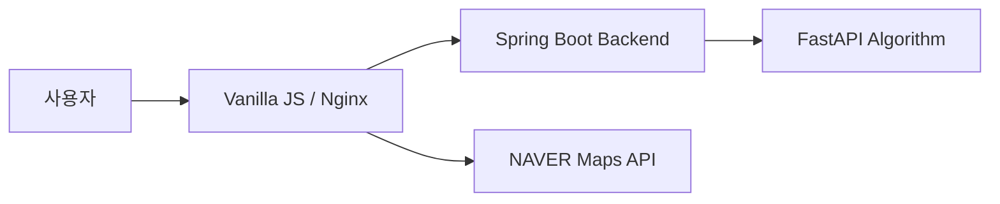
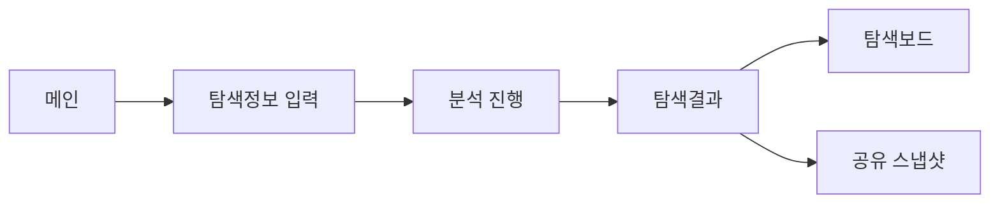

# GoldenStep Frontend

보행 네트워크 기반의 **실종자 골든타임 수색 지원 서비스**, GoldenStep의 프론트엔드 저장소입니다.

사용자가 실종자의 마지막 확인 위치와 시각, 대상자 정보를 입력할 수 있는 화면을 제공하며, 분석 결과로 생성된 예상 탐색 범위와 우선 확인 지역을 지도에서 확인할 수 있도록 시각화합니다. 또한 탐색 진행 상태 관리, 탐색보드, 공유 스냅샷 등의 사용자 인터페이스를 제공합니다.

## 프로젝트 구성

GoldenStep은 세 개의 독립된 저장소로 구성됩니다.

| 구성 요소 | 역할 | 저장소 |
| --- | --- | --- |
| Frontend | 지도 기반 탐색정보 입력·분석 결과 시각화·탐색 UI 제공 | 현재 저장소 |
| Backend | API 제공, 수색 세션·분석 결과 저장, 외부 서비스 연동 | [goldenstep-backend](https://github.com/Hop-Radar/goldenstep-backend) |
| Algorithm | 보행 네트워크 기반 수색 영역·우선 장소 분석 | [goldenstep-algorithm](https://github.com/Hop-Radar/goldenstep-algorithm) |



## 주요 기능

- **탐색정보 입력**: 실종 시각, 대상자 정보, 추가정보를 입력하고 필수 항목을 검증합니다.
- **마지막 확인 위치 지정**: NAVER Maps API를 활용해 장소를 검색하거나 지도에서 직접 위치를 선택할 수 있습니다.
- **분석 진행 상태 확인**: 탐색 요청 이후 분석 진행 상태를 화면에서 확인할 수 있습니다.
- **시간대별 탐색결과 확인**: 현재 및 30분·1시간·3시간·6시간 기준의 분석 결과를 확인할 수 있습니다.
- **지도 기반 탐색범위 시각화**: 분석 결과를 지도 위 탐색범위와 우선확인지역으로 표시합니다.
- **우선확인지역 확인**: 우선적으로 확인할 장소의 순위와 상세정보를 제공합니다.
- **탐색 상태 관리**: 실제로 확인한 장소의 상태를 관리하고 탐색을 종료하거나 계속 진행할 수 있습니다.
- **탐색보드 제공**: 현재 탐색과 관련된 주요 정보를 별도의 보드 화면에서 확인할 수 있습니다.
- **공유 스냅샷**: 탐색정보와 지도, 우선확인지역을 다른 사용자와 공유할 수 있습니다.
- **긴급 신고 안내**: 112 신고 등 실종 상황에서 필요한 긴급 안내 기능을 제공합니다.

## 화면 흐름



| 화면 | 파일 | 주요 역할 |
| --- | --- | --- |
| 메인 | `index.html` | 서비스 진입 및 탐색 시작 |
| 탐색정보 입력 | `search-form.html` | 대상자 정보·실종 시각·마지막 확인 위치 입력 |
| 분석 진행 | `analysis-loading.html` | 분석 진행 상태 확인 |
| 탐색결과 | `search-result.html` | 지도 기반 탐색범위 및 우선확인지역 확인 |
| 탐색보드 | `search-board.html` | 탐색 관련 주요 정보 확인 |
| 공유 스냅샷 | `share-map.html` | 탐색결과 공유 및 조회 |

## 기술 스택

| 구분 | 기술 |
| --- | --- |
| Markup | HTML5 |
| Style | CSS3 |
| Language | JavaScript (ES6+) |
| Map | NAVER Maps API |
| Web Server | Nginx |
| Container | Docker |
| CI/CD | GitHub Actions |

프론트엔드는 별도의 JavaScript 프레임워크 없이 **HTML, CSS, Vanilla JavaScript**를 기반으로 구현했습니다.

## 프론트엔드 구조

```text
goldenstep-frontend/
├── .github/
│   └── workflows/
│       ├── cd.yml
│       └── frontend-ci.yml
├── assets/
│   ├── icons/
│   │   └── favicon.png
│   └── images/
│       ├── emergency-112.png
│       ├── golden-step-logo.png
│       └── main-hero-map.png
├── css/
│   ├── analysis-loading.css
│   ├── common.css
│   ├── main.css
│   ├── search-board.css
│   ├── search-form.css
│   ├── search-result.css
│   └── share-map.css
├── infra/
│   ├── docker-entrypoint.sh
│   ├── nginx.conf
│   └── README.md
├── js/
│   ├── analysis-loading.js
│   ├── api-config.js
│   ├── common.js
│   ├── env-config.js
│   ├── main.js
│   ├── naver-map-loader.js
│   ├── search-board.js
│   ├── search-form.js
│   ├── search-result.js
│   └── share-map.js
├── analysis-loading.html
├── index.html
├── search-board.html
├── search-form.html
├── search-result.html
├── share-map.html
├── .dockerignore
├── .env.example
├── Dockerfile
└── README.md
```

## 주요 JavaScript 구성

| 파일 | 역할 |
| --- | --- |
| `main.js` | 메인 화면 동작 처리 |
| `search-form.js` | 탐색정보 입력, 위치 선택 및 입력값 처리 |
| `analysis-loading.js` | 분석 진행 상태 처리 |
| `search-result.js` | 탐색결과 및 지도 UI 처리 |
| `search-board.js` | 탐색보드 화면 처리 |
| `share-map.js` | 공유 스냅샷 화면 처리 |
| `naver-map-loader.js` | NAVER Maps API 동적 로드 |
| `api-config.js` | API 요청 관련 설정 |
| `env-config.js` | 실행 환경 설정 |
| `common.js` | 공통 UI 및 기능 처리 |

## API 연동 구조

프론트엔드는 백엔드 API를 통해 탐색 세션 생성, 분석 상태 조회, 탐색결과 조회 등의 데이터를 전달받습니다.

배포 환경에서는 Nginx가 정적 프론트엔드 리소스를 제공하며 `/api/` 요청을 백엔드 서비스로 전달합니다.

```text
Browser
   │
   ▼
Frontend / Nginx
   │
   ├── HTML / CSS / JavaScript
   ├── NAVER Maps API
   │
   └── /api/*
          │
          ▼
   Spring Boot Backend
          │
          ▼
   FastAPI Algorithm
```

## 환경 설정

NAVER Maps API 사용을 위해 환경 변수를 설정합니다.

`.env.example`을 참고하여 로컬 환경의 `.env` 파일을 구성합니다.

```env
NAVER_MAP_CLIENT_ID=your_client_id
```

실제 API 키와 인증정보가 포함된 `.env` 파일은 Git 저장소에 커밋하지 않습니다.

## 로컬 실행

별도의 프론트엔드 빌드 과정 없이 정적 웹 프로젝트로 실행할 수 있습니다.

VS Code의 Live Server 등을 이용해 `index.html`을 실행합니다.

```text
index.html
```

NAVER Maps API를 사용하는 경우 등록된 Web Service URL과 실행 환경이 일치해야 합니다.

## Docker

프론트엔드는 Nginx 기반 Docker 이미지로 실행할 수 있습니다.

```bash
docker build -t goldenstep-frontend .
```

```bash
docker run -p 8081:80 --env-file .env goldenstep-frontend
```

실행 후 다음 주소에서 프론트엔드에 접근할 수 있습니다.

```text
http://localhost:8081
```

Nginx 설정은 `infra/nginx.conf`, 컨테이너 실행 시 환경 변수 처리는 `infra/docker-entrypoint.sh`에서 관리합니다.

## CI/CD

`.github/workflows/`에서 프론트엔드 CI/CD 워크플로를 관리합니다.

- `frontend-ci.yml`: 프론트엔드 코드 검증
- `cd.yml`: 배포 자동화

## 협업 안내

GoldenStep Frontend는 `main`, `develop`, 기능 브랜치를 기준으로 협업합니다.

기능 개발 및 수정 사항은 작업 브랜치에서 진행하고, 검증 후 프로젝트의 브랜치 전략에 따라 병합합니다. Backend 또는 Algorithm과 연동되는 API 변경 사항이 있는 경우 관련 저장소의 변경 내용과 함께 확인합니다.

API 키, 비밀번호 및 운영 환경의 인증정보는 공개 문서나 소스 코드에 포함하지 않습니다.
