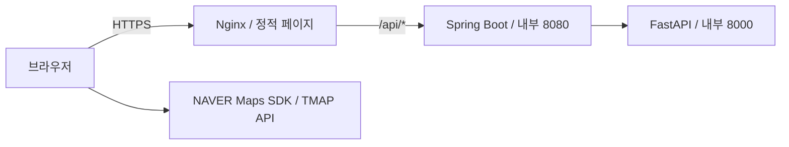

# GoldenStep 프론트엔드 배포 가이드

프론트엔드는 HTML·CSS·JavaScript를 Nginx로 제공합니다. 공통 AWS 환경의 단일 EC2에서 백엔드·AI와 함께 Docker Compose로 실행하며, 외부 HTTP·HTTPS 요청의 진입점입니다.

공개 문서에는 실제 계정 ID·ARN·리소스 ID·IP·도메인·API 키·내부 운영 기록을 포함하지 않습니다. 예시 값은 담당자가 배포 환경에 맞게 설정합니다.

## 아키텍처와 팀 역할



- 프론트엔드 팀은 페이지·스타일·JavaScript·Docker 이미지와 프론트엔드 CD를 관리합니다.
- 공통 CloudFormation·통합 Compose·운영 TLS 설정은 백엔드 저장소의 `infra/`에서 관리합니다. 이 파일들은 세 서비스의 공통 배포 설정입니다.
- NAVER 지도와 TMAP 보행 경로는 브라우저에서 사용합니다. 백엔드 요청은 같은 사이트의 `/api/*` 경로를 사용합니다.
- 운영에서는 Nginx 80/443만 외부에 공개하며 백엔드·AI는 Docker 내부 네트워크로 통신합니다.

## 파일 구성

| 파일 | 역할 |
| --- | --- |
| [../Dockerfile](../Dockerfile) | Nginx 기반 정적 파일 이미지 빌드 |
| [nginx.conf](nginx.conf) | 이미지 기본 HTTP 설정과 개발용 API 프록시 |
| [docker-entrypoint.sh](docker-entrypoint.sh) | 환경변수로 `js/env-config.js` 생성 후 Nginx 실행 |
| [../.github/workflows/frontend-ci.yml](../.github/workflows/frontend-ci.yml) | 기존 HTML·CSS·JavaScript 검사 |
| [../.github/workflows/cd.yml](../.github/workflows/cd.yml) | `main` push 전용 이미지 빌드·ECR 업로드·SSM 배포 |

기본 `nginx.conf`는 `host.docker.internal:8080`으로 API를 전달합니다. 운영 통합 Compose는 별도의 HTTPS 설정을 `/etc/nginx/conf.d/default.conf`에 마운트하고 `backend:8080`으로 전달합니다. 운영 인증서는 호스트의 인증서 디렉터리를 읽기 전용으로 마운트합니다.

## 개발·빌드 검증

아래 명령은 프론트엔드 저장소 최상위 디렉터리에서 실행합니다.

```bash
python -m http.server 5500
```

정적 서버를 사용할 때는 Docker entrypoint가 실행되지 않습니다. 지도 설정 파일과 백엔드 API 연결은 개발 환경에서 별도로 준비해야 합니다.

```bash
npx --yes html-validate "*.html"
npx --yes stylelint "css/**/*.css" --config .stylelintrc.json
for file in js/*.js; do node --check "$file"; done

docker build --platform linux/amd64 -t goldenstep-frontend:local .
```

## 런타임 환경변수

| 이름 | 용도 | 주입 위치 |
| --- | --- | --- |
| `NAVER_MAP_CLIENT_ID` | NAVER 지도 SDK 식별자 | EC2 프론트엔드 환경 파일 |
| `TMAP_APP_KEY` | TMAP 보행 경로 API 키 | EC2 프론트엔드 환경 파일 |

공통 초기 배포 도구가 Secrets Manager의 값을 조회해 권한 `0600` 환경 파일로 저장합니다. entrypoint는 컨테이너 시작 시 해당 값을 브라우저 설정 파일에 기록합니다. 이미지 빌드 인자로 실제 키를 넣지 않습니다.

브라우저용 키는 사용자에게 전달되므로 비밀 저장만으로 접근을 제한할 수 없습니다. API 공급자 콘솔에서 허용 서비스 URL과 이용 범위를 설정합니다. 서버 전용 Client Secret은 브라우저 설정에 넣지 않습니다.

## GitHub CD 설정

GitHub **Settings → Secrets and variables → Actions → Variables**에 등록합니다. GitHub Environment가 아닌 저장소 Variables를 사용합니다.

| 변수 | 예시 / 설정 방법 |
| --- | --- |
| `AWS_REGION` | `ap-northeast-2` |
| `AWS_ROLE_ARN` | `<FRONTEND_GITHUB_DEPLOY_ROLE_ARN>` |
| `EC2_INSTANCE_ID` | `<APP_INSTANCE_ID>` |
| `SERVICE_URL` | `https://app.example.com`; 담당 환경의 주소로 설정 |

OIDC 역할은 해당 저장소의 정확한 식별자와 `main` 브랜치만 허용해야 합니다. AWS 계정 ID는 STS로 조회하며 Access Key를 저장소 Secret에 등록하지 않습니다. `SERVICE_URL`을 생략하면 워크플로에 정의된 기본값을 사용하므로 다른 환경에서는 명시적으로 설정합니다.

CD 실행 순서:

1. HTML·CSS·JavaScript 검사
2. OIDC 인증과 Linux amd64 이미지 빌드
3. `goldenstep-frontend:<GIT_SHA>` 이미지를 ECR에 업로드
4. 최신 `main` 커밋인지 확인 후 SSM 명령 실행
5. 공통 배포 잠금 획득, `FRONTEND_IMAGE` 갱신과 `frontend` 컨테이너만 교체
6. HTTPS 페이지·백엔드 상태 API 확인, 실패 시 이전 이미지 복구 시도

`develop` → `main` PR 병합으로 CD가 실행됩니다. PR·`develop` push는 CD를 실행하지 않습니다. 직접 `main` push도 같은 이벤트이므로 PR 필수 정책은 GitHub 브랜치 규칙으로 설정합니다.

CD는 모델 데이터·DB·CloudFormation·호스트 TLS 설정을 변경하지 않습니다. 런타임 API 키 변경은 공통 배포 담당자와 환경 파일 갱신·컨테이너 재생성을 진행합니다. 운영 Nginx 설정은 호스트 마운트가 우선하므로 이미지의 `nginx.conf` 변경만으로 반영되지 않습니다.

## 배포 후 확인

- HTTPS 페이지와 정적 파일 응답, 브라우저 콘솔·네트워크 오류를 확인합니다.
- 지도 표시·주소 검색·위치 선택·수색 분석·결과·보행 경로를 점검합니다.
- API 프록시, 허용 도메인, 런타임 키와 캐시된 JavaScript를 확인합니다.
- 장애는 GitHub Actions 로그와 SSM Command ID로 추적합니다. 실제 키·사용자 입력을 공개 이슈에 첨부하지 않습니다.
- 단일 프론트엔드 컨테이너 교체 중 잠시 요청이 실패할 수 있으며 무중단을 보장하지 않습니다.
